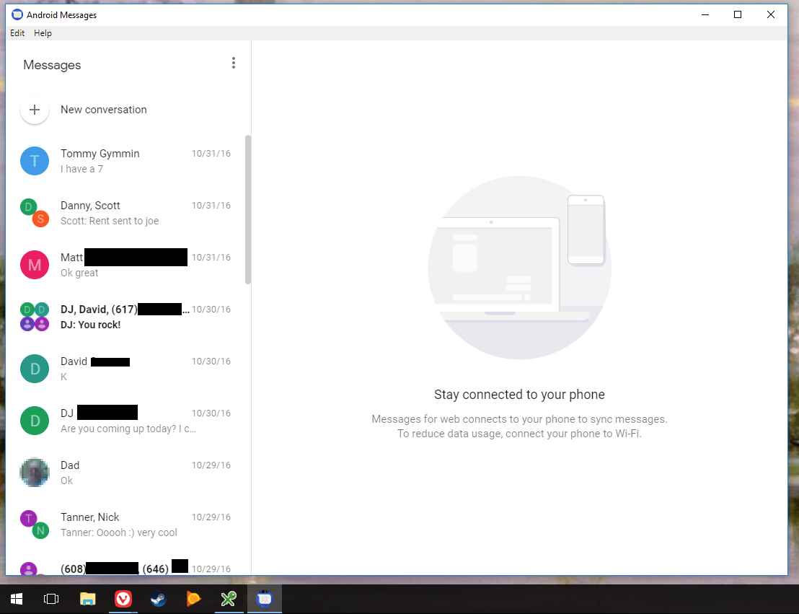
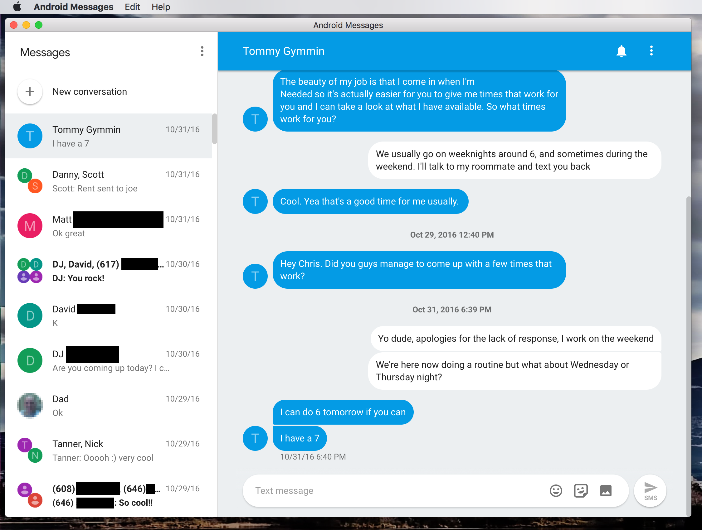
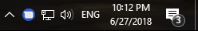
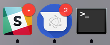

I am not the developer of this application, I am simply providing an arm64 build here since the developer does not. This build was tested on a Nintendo Switch running Ubuntu 18.04. I may update on new releases at the source: https://github.com/chrisknepper/android-messages-desktop

# Android Messages™ Desktop  

Run Android Messages as a desktop app, a la iMessage. For those of us that prefer not to have a browser tab always open for this sort of thing.

**Not affiliated with Google in any way. Android is a trademark of Google LLC.**

 
 
 
 
